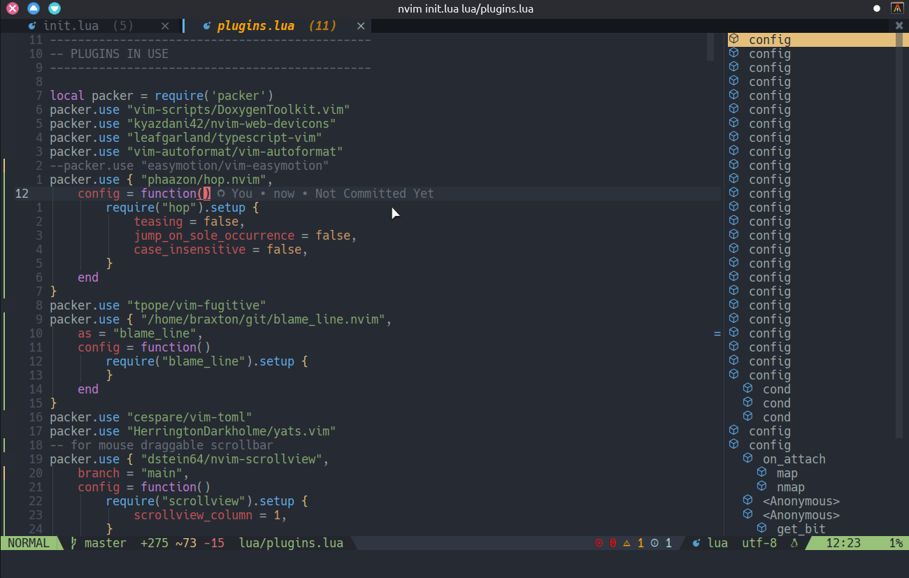

<h1 align="center">
	blame_line.nvim
</h1>

<p align="center"> A simple and configurable git blame line using virtual text for Neovim 0.7+ built using <b>lua</b>.</p>



This plugin provides a virtual-text annotation containing user-specified info from `git blame`
for the current line.

This plugin is implemented completely in lua, but is heavily inspired by and in some ways
is a fork & rewrite of blamer.nvim by APZelos (see https://github.com/APZelos/blamer.nvim).

The primary reason for this plugin's existence is that existing offerings either
(1) didn't work on all platforms (e.g., Windows) (or at all) or
(2) were too slow and introduced flicker in the current line (this is the case for blamer.nvim).

This plugin aims to solve both of those problems.

# Table of Contents
- [Requirements](#requirements)
- [Installation](#installation)
- [Quickstart](#quickstart)
	- [Setup](#setup)
	- [Commands](#commands)

## Requirements

* Requires Neovim version 0.7 or higher and `git` installed and in `PATH`

## Installation

* Simply install like you would any other plugin using your favorite package manager, e.g. with packer.nvim:
 	
	```lua
	local packer = require("packer")
	packer.use { "braxtons12/blame_line.nvim",
		config = function()
			require("blame_line").setup {
			}
		end
	}
	```

## Quickstart

### Setup

* Setup and configuration uses lua. The setup with packer.nvim, with default configuration options, is shown below:

	```lua
	local packer = require("packer")
	packer.use { "braxtons12/blame_line.nvim",
		config = function()
			require("blame_line").setup {
				-- whether the blame line should be shown in visual modes
				show_in_visual = true,

				-- whether the blame line should be shown in insert mode
				show_in_insert = true,

				-- the string to prefix the blame line with
				prefix = " ",

				-- String specifying the the blame line format.
				-- Any combination of the following specifiers, along with any additional text.
				--     - `"<author>"` - the author of the change.
				--     - `"<author-mail>"` - the email of the author.
				--     - `"<author-time>"` - the time the author made the change.
				--     - `"<committer>"` - the person who committed the change to the repository.
				--     - `"<committer-mail>"` - the email of the committer.
				--     - `"<committer-time>"` - the time the change was committed to the repository.
				--     - `"<summary>"` - the commit summary/message.
				--     - `"<commit-short>"` - short portion of the commit hash.
				--     - `"<commit-long>"` - the full commit hash.
				template = "<author> • <author-time> • <summary>",

				-- The date format settings, for `"<author-time>"` and `"<committer-time>"`
				date = {
					-- whether the date should be relative instead of precise
					-- (I.E. "3 days ago" instead of "09-06-2022".
					relative = true,

					-- `strftime` compatible format string.
					-- Only used if `date.relative == false`
					format = "%d-%m-%y",
				},

				-- The highlight group to highlight the blame line with.
				-- The highlight of this group defaults to `Comment`.
				hl_group = "BlameLineNvim",

				-- The delay in milliseconds between a cursor movement and
				-- when the blame line should appear/update
				delay = 0,
			}
		end
	}
	```

### Commands

* blame_line.nvim only provides three commands, all for enabling/disabling the plugin:

	- `BlameLineEnable` - Enables the blame line for files tracked by git, in modes valid for the current configuration (see `blame_line.setup.show_in_insert` and see `blame_line.setup.show_in_visual`).
	  By default, the blame line is enabled
	- `BlameLineDisable` - Disables the blame line completely until the user calls `BlameLineEnable` or `lua require("blame_line").enable()` to re-enable the blame line.
	- `BlameLineToggle` - Toggles whether the blame line is enabled.
	  Equivalent to calling `BlameLineEnable` if the blame line is disabled or `BlameLineDisable` if it is enabled.
